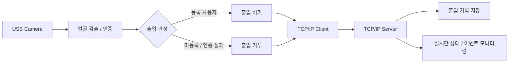

# 🚪 얼굴인식 출입통제 시스템

> 얼굴 등록·인증을 통해 출입 여부를 판정하고, TCP/IP 통신을 통해 서버에서 출입 기록과 상태를 모니터링하는 시스템

---

##  프로젝트 목적

얼굴을 출입 인증 수단으로 활용하여 등록 사용자와 미등록 사용자를 구분하고,  
인증 결과를 서버로 전달해 출입 상태와 기록을 한 곳에서 확인할 수 있는 시스템을 구현하는 것이 목적입니다.

또한 C# / .NET 기반 Windows 응용 프로그램에서  
**얼굴 인식 기능과 TCP/IP 기반 Client-Server 통신을 하나의 시스템으로 연동**하는 것을 목표로 합니다.

---

##  기술 스택

| 구분 | 기술 | 사용 목적 |
|---|---|---|
| 언어 | C# | Client / Server 프로그램 개발 |
| 플랫폼 | .NET | Windows 응용 프로그램 개발 |
| AI | Face Recognition | 등록 사용자 얼굴 인증 |
| 통신 | TCP/IP | Client → Server 인증 결과 및 상태 전달 |
| 데이터 | 공통 DB | 사용자 정보 및 출입 기록 관리 |

---

## 🏗 시스템 구성

### 구성 흐름

**Camera → 얼굴 검출·인증 → 출입 판정 → TCP/IP Client → TCP/IP Server → 출입 기록 / 모니터링**

- **Client**: 카메라 입력, 얼굴 인증, 출입 허가·거부 판정
- **Server**: Client 연결 관리, 인증 결과 수신, 출입 기록 및 상태 모니터링
- **Database**: 사용자 정보와 출입 이력 저장

---
